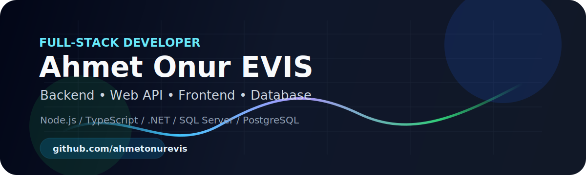

<div align="center">



# 👋 Merhaba, ben Ahmet Onur EVİS

**Bilgisayar Mühendisi · IT Operations · Full-Stack & IoT Solutions**

Teknoloji süreçlerini stratejik bir bakış açısıyla yöneten ve yüksek performanslı çözümler üreten bir Bilgisayar Mühendisiyim.  
Kurumsal IT operasyonlarına liderlik etmenin yanı sıra yazılım ve donanımın kesiştiği noktalarda; IoT sistemleri, endüstriyel otomasyon, web tabanlı yönetim panelleri ve özel entegrasyonlar geliştiriyorum.  
Benim için mühendislik yalnızca günü kurtaran bir ürün ortaya koymak değil; temiz bir mimari kurgulamak, veri güvenliğini uçtan uca sağlamak ve gelecekteki büyümelere kolayca adapte olabilen sürdürülebilir sistemler kurmaktır.


</div>

---

## 🚀 Kısa Profil

- 🧠 Kurumsal IT operasyonları, sistem sürekliliği ve teknik süreç yönetimi üzerine çalışıyorum.
- 🧩 Full-stack tarafta API, dashboard, admin paneli, web arayüzü ve özel entegrasyonlar geliştiriyorum.
- 🔌 Yazılım ve donanımın kesiştiği IoT, cihaz bağlantısı ve otomasyon senaryolarıyla ilgileniyorum.
- 🔐 Güvenli veri akışı, rol/yetki yönetimi, validasyon ve sürdürülebilir mimari konularına önem veriyorum.
- 📚 Teslim edilen projelerde dokümantasyon, kurulum ve bakım süreçlerini ürünün bir parçası olarak görüyorum.

## 🧱 Teknoloji Yığını

<div align="center">


</div>

| Alan | Kullandığım Teknolojiler |
|------|--------------------------|
| **Backend** | Node.js, Express, ASP.NET Core, ASP.NET MVC, REST API |
| **Frontend** | Next.js, React, Vue, Razor Views, HTML, CSS, SCSS, Tailwind CSS |
| **Dil** | TypeScript, JavaScript, C#, SQL, C++ |
| **Veritabanı** | PostgreSQL, SQL Server, Prisma, Entity Framework |
| **Mobil & Cihaz** | Capacitor, Android, ESP8266, Arduino |
| **Araçlar** | Git, GitHub, Swagger, PM2, Nginx, Redis |

## ⚡ Teknik Odaklarım

```text
Node.js API                ███████████████████░
Web Frontend               ██████████████████░░
ASP.NET MVC/Core           ████████████████░░░░
Database Design            ██████████████████░░
Admin Panel & Dashboard    ███████████████████░
Full-Stack Architecture    █████████████████░░░
```

## 📌 Öne Çıkan Public Projeler

| Proje | Açıklama | Teknolojiler |
|-------|----------|--------------|
| [AbbaraShowroom](https://github.com/ahmetonurevis/AbbaraShowroom) | Ürün showroom ve yönetim paneli | ASP.NET Core, EF Core, SQL Server |
| [SignalRProject](https://github.com/ahmetonurevis/SignalRProject) | Restoran yönetimi ve katmanlı .NET mimarisi | .NET 6, Web API, MVC |
| [PortfolioProjectNigth](https://github.com/ahmetonurevis/PortfolioProjectNigth) | Kişisel web sitesi ve admin paneli | ASP.NET MVC, EF, SQL Server |

## 🧭 Çalışma Tarzım

1. Önce problemi ve iş akışını netleştiririm.
2. Veritabanı modelini gerçek kullanım senaryosuna göre tasarlarım.
3. API tarafında güvenlik, validasyon ve hata yönetimini baştan düşünürüm.
4. Arayüzde sade, hızlı ve kullanıcıyı yormayan ekranlar kurmaya çalışırım.
5. Dokümantasyonu projenin parçası olarak görürüm.

## 📊 GitHub İstatistikleri

<div align="center">

<!-- github-readme-stats bazı zamanlarda GitHub içinde kırılabildiği için daha stabil summary-cards kullanıldı. -->


</div>

## 📫 İletişim

<div align="center">

[](https://github.com/ahmetonurevis)
[](https://www.linkedin.com/search/results/all/?keywords=Ahmet%20Onur%20EVİS)

</div>

---

<div align="center">
<sub>Temiz mimari, güçlü backend yapıları ve kullanıcı odaklı arayüzlerle sürdürülebilir yazılım ürünleri geliştiriyorum. 🚀</sub>
</div>
