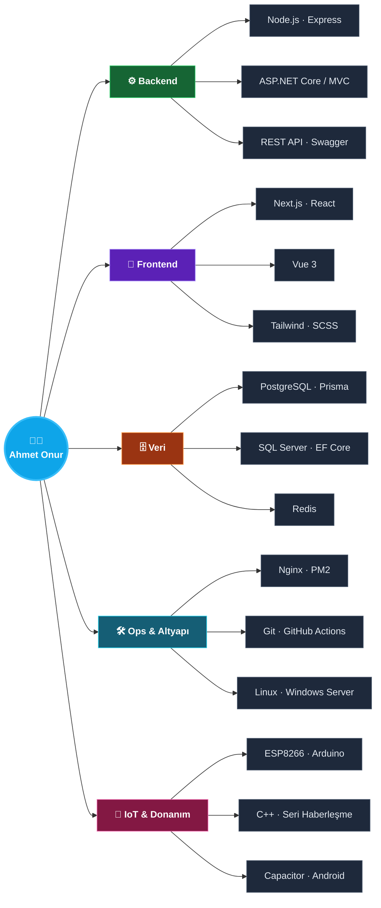
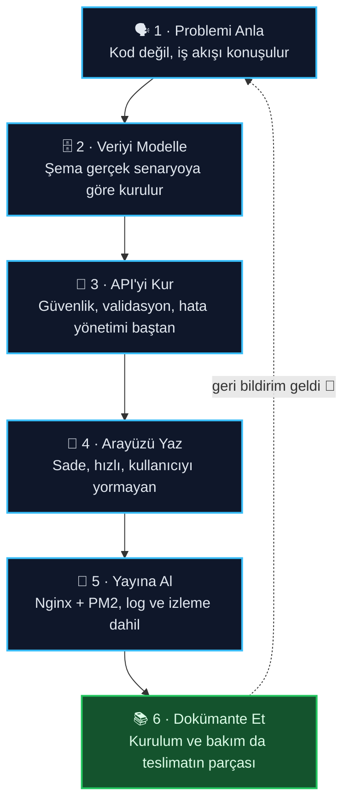

<div align="center">



<a href="https://github.com/ahmetonurevis">
  
</a>

<br>


[](https://github.com/ahmetonurevis?tab=followers)
[](https://github.com/ahmetonurevis?tab=repositories)

<br>

### 🧭 Nereye gitmek istersin?

[**🙋 Tanışalım**](#-whoami) &nbsp;·&nbsp;
[**🗺️ Yetkinlikler**](#️-yetenek-haritası) &nbsp;·&nbsp;
[**🧰 Cephanelik**](#-cephanelik) &nbsp;·&nbsp;
[**🔄 Çalışma Tarzım**](#-bir-proje-bende-nasıl-ilerler) &nbsp;·&nbsp;
[**📊 İstatistikler**](#-rakamlar-konuşsun) &nbsp;·&nbsp;
[**📌 Projeler**](#-vitrin) &nbsp;·&nbsp;
[**🎲 Eğlence**](#-mola-verelim) &nbsp;·&nbsp;
[**📫 İletişim**](#-selam-ver)

</div>

---

## 🙋 whoami

```yaml
ad:        "Ahmet Onur EVİS"
unvan:     "Bilgisayar Mühendisi"
okul:      "Kütahya Dumlupınar Üniversitesi"
roller:    ["IT Operations", "Full-Stack Developer", "IoT & Otomasyon"]
konum:     "Türkiye 🇹🇷"

su_an:     "Kurumsal ERP, stok ve teklif sistemlerini uçtan uca kuruyorum"
ogreniyor: ["Kubernetes", "Sistem Tasarımı", "Gözlemlenebilirlik (observability)"]
sorabilirsin: ["Node.js API", ".NET Core", "SQL Server", "ESP8266", "Nginx & PM2"]
motto:     "Çalışan kod iyidir; 6 ay sonra da anlaşılan kod daha iyidir."
```

Teknoloji süreçlerini stratejik bir bakış açısıyla yöneten bir Bilgisayar Mühendisiyim. Kurumsal IT
operasyonlarına liderlik etmenin yanı sıra **yazılım ile donanımın kesiştiği** noktada iş yapmayı seviyorum:
IoT sistemleri, endüstriyel otomasyon, web tabanlı yönetim panelleri ve özel entegrasyonlar.

<details>
<summary><b>🔍 Biraz daha derine inelim...</b> <i>(tıkla)</i></summary>

<br>

**Beni tanımlayan 5 cümle:**

| | |
|---|---|
| 🧠 | Kurumsal IT operasyonları, sistem sürekliliği ve teknik süreç yönetimi benim doğal ortamım. |
| 🧩 | Full-stack tarafta API, dashboard, admin paneli ve özel entegrasyonlar geliştiriyorum. |
| 🔌 | Yazılım ile donanımın buluştuğu yerde — IoT, cihaz haberleşmesi, otomasyon — mutluyum. |
| 🔐 | Güvenli veri akışı, rol/yetki yönetimi ve validasyonu sonradan eklenen değil, **baştan tasarlanan** şeyler görürüm. |
| 📚 | Dokümantasyon benim için "vakit kalırsa" değil, ürünün teslim edilebilir bir parçasıdır. |

**Peki neyi sevmiyorum?**

- 🚫 "Şimdilik böyle kalsın, sonra düzeltiriz" denilip 3 yıl kalan kodlar
- 🚫 `SELECT *` ile çekilip frontend'de filtrelenen 40 bin satır
- 🚫 Tek bir README'si bile olmayan, "adamı bul soruver" ile ayakta duran sistemler

</details>

---

## 🗺️ Yetenek Haritası


```mermaid
flowchart LR
    ME(("👨‍💻<br>Ahmet Onur")):::core

    ME --> BE["⚙️ Backend"]:::be
    ME --> FE["🎨 Frontend"]:::fe
    ME --> DB["🗄️ Veri"]:::db
    ME --> OPS["🛠️ Ops & Altyapı"]:::ops
    ME --> IOT["🔌 IoT & Donanım"]:::iot

    BE  --> BE1["Node.js · Express"]:::leaf
    BE  --> BE2["ASP.NET Core / MVC"]:::leaf
    BE  --> BE3["REST API · Swagger"]:::leaf

    FE  --> FE1["Next.js · React"]:::leaf
    FE  --> FE2["Vue 3"]:::leaf
    FE  --> FE3["Tailwind · SCSS"]:::leaf

    DB  --> DB1["PostgreSQL · Prisma"]:::leaf
    DB  --> DB2["SQL Server · EF Core"]:::leaf
    DB  --> DB3["Redis"]:::leaf

    OPS --> OP1["Nginx · PM2"]:::leaf
    OPS --> OP2["Git · GitHub Actions"]:::leaf
    OPS --> OP3["Linux · Windows Server"]:::leaf

    IOT --> IO1["ESP8266 · Arduino"]:::leaf
    IOT --> IO2["C++ · Seri Haberleşme"]:::leaf
    IOT --> IO3["Capacitor · Android"]:::leaf

    classDef core fill:#0ea5e9,stroke:#38bdf8,stroke-width:3px,color:#fff,font-weight:bold
    classDef be   fill:#166534,stroke:#22c55e,color:#fff,font-weight:bold
    classDef fe   fill:#5b21b6,stroke:#a78bfa,color:#fff,font-weight:bold
    classDef db   fill:#9a3412,stroke:#fb923c,color:#fff,font-weight:bold
    classDef ops  fill:#155e75,stroke:#22d3ee,color:#fff,font-weight:bold
    classDef iot  fill:#831843,stroke:#f472b6,color:#fff,font-weight:bold
    classDef leaf fill:#1e293b,stroke:#475569,color:#e2e8f0
```

---

## 🧰 Cephanelik

<div align="center">


</div>

<details>
<summary><b>⚙️ Backend & API</b> — <i>işin motoru</i></summary>

<br>

| Teknoloji | Nerede kullanıyorum |
|---|---|
| **Node.js + Express** | ERP, teklif ve stok sistemlerinin REST API katmanı |
| **ASP.NET Core / MVC** | Kurumsal .NET projeleri, katmanlı mimari, Razor Views |
| **Entity Framework Core** | .NET tarafında ORM, migration yönetimi |
| **Prisma** | TypeScript projelerinde tip güvenli veritabanı erişimi |
| **SignalR** | Gerçek zamanlı bildirim ve canlı dashboard ekranları |
| **Swagger / OpenAPI** | API'leri teslim ederken dokümantasyonuyla birlikte veriyorum |

</details>

<details>
<summary><b>🎨 Frontend & Arayüz</b> — <i>kullanıcının gördüğü kısım</i></summary>

<br>

| Teknoloji | Nerede kullanıyorum |
|---|---|
| **Next.js / React** | Admin panelleri, dashboard'lar, SSR gereken ekranlar |
| **Vue 3** | Stok takip ve iç kullanım uygulamaları |
| **Tailwind CSS / SCSS** | Hızlı, tutarlı ve bakımı kolay arayüz katmanı |
| **Razor Views** | .NET MVC projelerinde sunucu taraflı render |
| **Capacitor** | Web uygulamalarını Android'e taşırken |

</details>

<details>
<summary><b>🗄️ Veri & Depolama</b> — <i>her şeyin gerçekten yaşadığı yer</i></summary>

<br>

| Teknoloji | Nerede kullanıyorum |
|---|---|
| **PostgreSQL** | Yeni nesil projelerin ana veritabanı |
| **SQL Server** | Kurumsal .NET ekosisteminde |
| **Redis** | Cache, session ve kuyruk senaryoları |
| **Veri modelleme** | Şemayı ekrana göre değil, **gerçek iş akışına** göre tasarlarım |

</details>

<details>
<summary><b>🛠️ Ops, Altyapı & Araçlar</b> — <i>gece 3'te ayakta kalması gereken kısım</i></summary>

<br>

| Teknoloji | Nerede kullanıyorum |
|---|---|
| **Nginx** | Reverse proxy, SSL sonlandırma, statik dosya sunumu |
| **PM2** | Node.js süreç yönetimi, otomatik restart, log takibi |
| **Git & GitHub** | Branch stratejisi, code review, sürüm yönetimi |
| **Linux / Windows Server** | Kurumsal sunucu yönetimi ve sistem sürekliliği |

</details>

<details>
<summary><b>🔌 IoT & Donanım</b> — <i>yazılımın fiziksel dünyaya dokunduğu yer</i></summary>

<br>

| Teknoloji | Nerede kullanıyorum |
|---|---|
| **ESP8266 / Arduino** | Sıcaklık ve sensör takip sistemleri |
| **C++** | Gömülü tarafın firmware'i |
| **Seri / HTTP haberleşme** | Cihaz → sunucu veri akışı ve canlı izleme panelleri |

</details>

---

## 🔄 Bir Proje Bende Nasıl İlerler?


```mermaid
flowchart TD
    A["🗣️ 1 · Problemi Anla<br>Kod değil, iş akışı konuşulur"]:::step
    B["🗄️ 2 · Veriyi Modelle<br>Şema gerçek senaryoya göre kurulur"]:::step
    C["🔐 3 · API'yi Kur<br>Güvenlik, validasyon, hata yönetimi baştan"]:::step
    D["🎨 4 · Arayüzü Yaz<br>Sade, hızlı, kullanıcıyı yormayan"]:::step
    E["🚀 5 · Yayına Al<br>Nginx + PM2, log ve izleme dahil"]:::step
    F["📚 6 · Dokümante Et<br>Kurulum ve bakım da teslimatın parçası"]:::done

    A --> B --> C --> D --> E --> F
    F -.->|"geri bildirim geldi 🔁"| A

    classDef step fill:#0f172a,stroke:#38bdf8,stroke-width:2px,color:#e2e8f0
    classDef done fill:#14532d,stroke:#22c55e,stroke-width:2px,color:#dcfce7
```

> 💡 **Sırrı yok:** adım 1'de harcanan 30 dakika, adım 5'te 3 günü kurtarıyor.

---

## 📊 Rakamlar Konuşsun

<div align="center">

<picture>
  <source media="(prefers-color-scheme: dark)" srcset="https://github-profile-summary-cards.vercel.app/api/cards/profile-details?username=ahmetonurevis&theme=tokyonight">
  <source media="(prefers-color-scheme: light)" srcset="https://github-profile-summary-cards.vercel.app/api/cards/profile-details?username=ahmetonurevis&theme=default">
  
</picture>

<br>

<picture>
  <source media="(prefers-color-scheme: dark)" srcset="https://github-profile-summary-cards.vercel.app/api/cards/repos-per-language?username=ahmetonurevis&theme=tokyonight">
  
</picture>
<picture>
  <source media="(prefers-color-scheme: dark)" srcset="https://github-profile-summary-cards.vercel.app/api/cards/most-commit-language?username=ahmetonurevis&theme=tokyonight">
  
</picture>

<picture>
  <source media="(prefers-color-scheme: dark)" srcset="https://github-profile-summary-cards.vercel.app/api/cards/stats?username=ahmetonurevis&theme=tokyonight">
  
</picture>
<picture>
  <source media="(prefers-color-scheme: dark)" srcset="https://github-profile-summary-cards.vercel.app/api/cards/productive-time?username=ahmetonurevis&theme=tokyonight&utcOffset=3">
  
</picture>

<br><br>


<br>


</div>

<details align="center">
<summary><b>🏆 Kupa dolabını aç</b></summary>

<br>

[](https://github.com/ryo-ma/github-profile-trophy)

</details>

### 🐍 Yılan katkılarımı yiyor

<div align="center">

<picture>
  <source media="(prefers-color-scheme: dark)" srcset="https://raw.githubusercontent.com/ahmetonurevis/ahmetonurevis/output/github-snake-dark.svg">
  <source media="(prefers-color-scheme: light)" srcset="https://raw.githubusercontent.com/ahmetonurevis/ahmetonurevis/output/github-snake.svg">
  
</picture>

<sub><i>Her gece 07:00'de (TR) bir GitHub Action bu animasyonu yeniden üretiyor.</i></sub>

</div>

---

## 📌 Vitrin

<div align="center">

<a href="https://github.com/ahmetonurevis/AbbaraShowroom">
  
</a>
<a href="https://github.com/ahmetonurevis/SignalRProject">
  
</a>

</div>

| Proje | Ne yapıyor? | Yığın |
|---|---|---|
| 🏬 [**AbbaraShowroom**](https://github.com/ahmetonurevis/AbbaraShowroom) | Ürün showroom sitesi + yönetim paneli | `ASP.NET Core` `EF Core` `SQL Server` |
| 🍽️ [**SignalRProject**](https://github.com/ahmetonurevis/SignalRProject) | Restoran yönetimi, canlı sipariş takibi ve katmanlı .NET mimarisi | `.NET 6` `SignalR` `Web API` `MVC` |
| 🌙 [**PortfolioProjectNigth**](https://github.com/ahmetonurevis/PortfolioProjectNigth) | Kişisel portföy sitesi + admin paneli | `ASP.NET MVC` `EF` `SCSS` |

<details>
<summary><b>🔒 Peki ya diğerleri?</b> <i>(depoların çoğu neden private?)</i></summary>

<br>

Ürettiğim işlerin önemli bir kısmı **kurumsal müşteri projeleri** olduğu için depolar private:
ERP modülleri, stok/raf yönetimi, teklif otomasyonu, mobil saha uygulamaları ve IoT sıcaklık
izleme sistemleri gibi. Bunlar hakkında konuşmak istersen çekinmeden yaz — mimariyi, aldığım
kararları ve öğrendiklerimi anlatmaktan keyif alırım. 🙂

| Alan | Örnek çalışmalar |
|---|---|
| 🏭 **ERP & Kurumsal** | Teks-Erp, TeksErp, ITStok, RafUygulamasi |
| 💰 **Finans & Teklif** | TeklifMatik, hesap-takip |
| 📱 **Mobil & Saha** | berp-mobil (Capacitor + Android) |
| 🌡️ **IoT** | sicaklik (ESP8266 · C++ · canlı izleme paneli) |
| 🧩 **Araçlar** | devcommand (geliştirici CLI aracı) |

</details>

---

## 🎲 Mola Verelim

<div align="center">


<sub><i>Sayfayı yenile, söz değişsin.</i></sub>

</div>

<br>

<details>
<summary><b>🧠 Mini quiz #1 — Türk geliştiricilerin klasik tuzağı</b> <i>(cevabı görmek için tıkla)</i></summary>

<br>

```csharp
// Sunucu locale'i tr-TR iken:
if ("ADMIN".ToLower() == "admin")
{
    GrantAccess();
}
```

**Bu kod çalışır mı?**

<br>

> **Cevap: HAYIR.** 🙃
>
> `tr-TR` kültüründe `"I".ToLower()` sonucu `"i"` değil, **`"ı"`** (noktasız i) döner.
> Yani karşılaştırma `"admın" == "admin"` olur ve `false` verir.
>
> **Doğrusu:**
> ```csharp
> if (string.Equals("ADMIN", "admin", StringComparison.OrdinalIgnoreCase))
> ```
> Kültüre bağlı olmayan karşılaştırma için `ToLowerInvariant()` veya `OrdinalIgnoreCase` kullan.
> Bu meşhur hataya **"Turkish-I problemi"** deniyor ve gerçek sistemlerde yetkilendirme açığına yol açtı.

</details>

<details>
<summary><b>🧠 Mini quiz #2 — JavaScript nazik değildir</b> <i>(cevabı görmek için tıkla)</i></summary>

<br>

```js
console.log([1, 2, 3, 10, 20].sort());
```

**Çıktı ne olur?**

<br>

> **Cevap:** `[1, 10, 2, 20, 3]`
>
> `Array.prototype.sort()` varsayılan olarak elemanları **string'e çevirip alfabetik sıralar.**
> `"10" < "2"` olduğu için 10, 2'nin önüne geçer.
>
> **Doğrusu:**
> ```js
> [1, 2, 3, 10, 20].sort((a, b) => a - b); // [1, 2, 3, 10, 20]
> ```

</details>

<details>
<summary><b>☕ Kod dışında ben</b></summary>

<br>

```text
Kahve tüketimi     ████████████████████  fazlasıyla yeterli
Karanlık tema      ████████████████████  pazarlık konusu değil
Tab vs Space       ████████████░░░░░░░░  Prettier ne derse
Gece kodlaması     ██████████████████░░  en verimli saatlerim yukarıda 👆
Dokümantasyon      ████████████████░░░░  evet, gerçekten yazıyorum
```

- 🔧 Boş vakit projelerim genelde "şu iş elle yapılıyor, otomatikleştireyim" diye başlar
- 🌡️ Evdeki sensörlerden veri toplayıp grafiğe dökmek bana tatil gibi geliyor
- 📖 Yeni bir teknolojiyi önce dokümantasyonundan okurum, sonra kurcalarım

</details>

---

## 📫 Selam Ver

<div align="center">

Bir fikrin mi var, bir sorun mu var, yoksa sadece merhaba mı demek istiyorsun? Kapım açık.

<br>

[](https://github.com/ahmetonurevis)
[](https://www.linkedin.com/search/results/all/?keywords=Ahmet%20Onur%20EV%C4%B0S)

<br>

---

<sub>Temiz mimari, sağlam backend yapıları ve kullanıcı odaklı arayüzlerle sürdürülebilir ürünler geliştiriyorum.</sub>

<br>

⭐ <i>Buraya kadar geldiysen, bir depoya yıldız bırakmayı unutma!</i>

</div>
